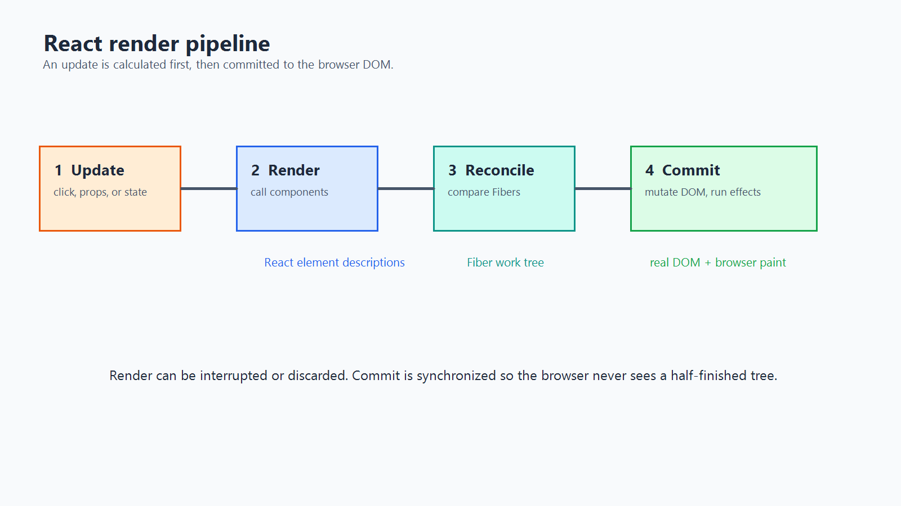
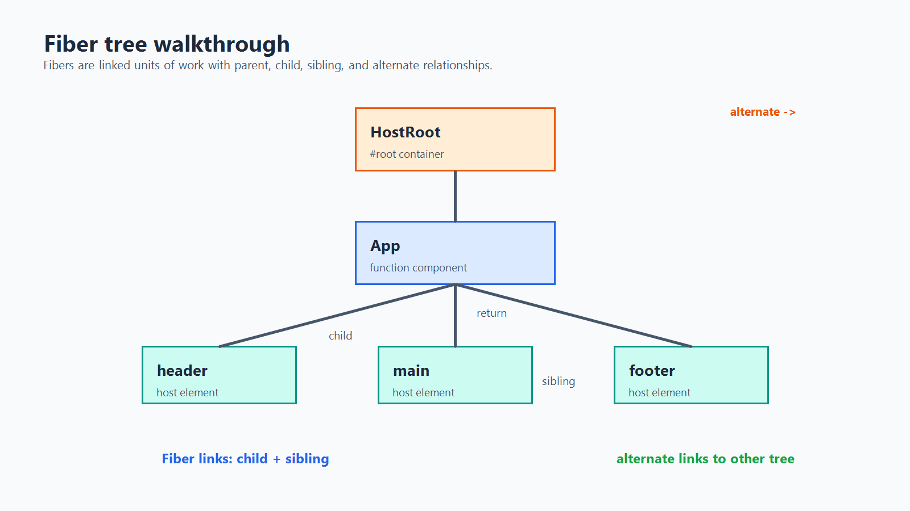
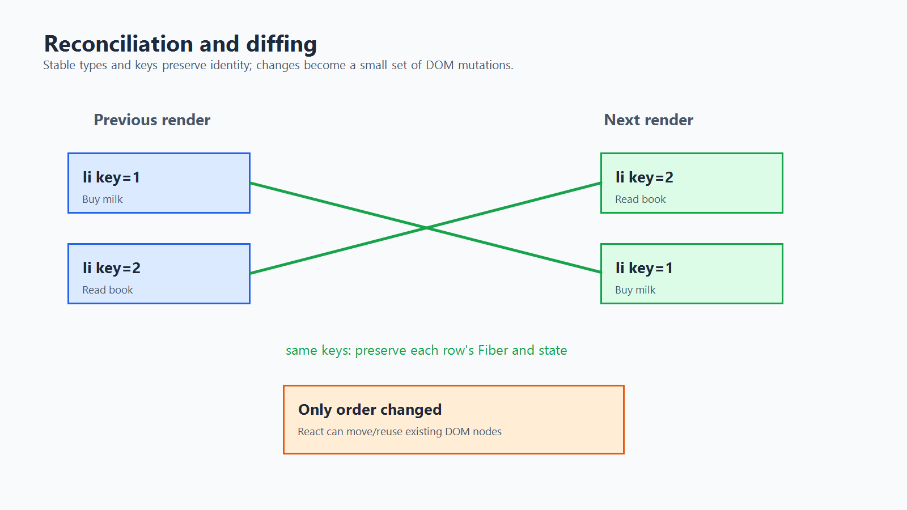

# How React Works Behind the Scenes

This guide follows a React 18 update from a component function to pixels on the screen. The example project uses `createRoot`, JSX, function components, and hooks, but the same mental model applies to most React applications.

## The short version

React separates **describing UI** from **updating the browser DOM**:

1. A state update or parent render schedules work on a root.
2. React calls components and produces React elements, often called the virtual DOM.
3. React builds or updates a tree of Fiber nodes while it reconciles the new result with the previous one.
4. The render phase calculates what should change. It should not produce visible side effects.
5. The commit phase applies the selected changes to the real DOM, runs layout effects, and then passive effects.
6. The browser paints the result.



The phrase **virtual DOM** is useful, but it is not a second browser DOM. React elements are lightweight JavaScript descriptions. Fiber is the long-lived work structure React uses to process those descriptions efficiently.

## 1. From JSX to React elements

JSX is syntax that is transformed into function calls. This:

```jsx
function Welcome({ name }) {
	return <h1 className="title">Hello, {name}</h1>;
}
```

is conceptually similar to:

```js
function Welcome({ name }) {
	return React.createElement(
		"h1",
		{ className: "title" },
		"Hello, ",
		name
	);
}
```

With the modern JSX transform, the compiler usually imports `jsx` from `react/jsx-runtime` instead of requiring `React.createElement` in every file. Either way, the result is a React element: a plain, immutable description containing information such as (shown here for a call like `<Welcome name="Ada" />`):

```js
{
	type: "h1",
	props: {
		className: "title",
		children: ["Hello, ", "Ada"]
	}
}
```

Important distinctions:

- A React element is a snapshot of what a component returned during one render.
- A DOM node is a browser-owned object with layout, event, and mutation behavior.
- React elements do not update themselves. A later render creates a new description.

## 2. What `createRoot` does

The application entry point contains:

```js
const root = ReactDOM.createRoot(document.getElementById("root"));
root.render(
	<React.StrictMode>
		<App />
	</React.StrictMode>
);
```

`createRoot` creates a React root associated with the `#root` DOM container. The root stores scheduling and tree state. Calling `root.render` gives React the initial element tree and schedules work. React then:

1. Creates a root Fiber for the container.
2. Creates child Fibers for `StrictMode`, `App`, and the elements returned by `App`.
3. Calls function components as it visits them.
4. Reconciles their returned children.
5. Commits the resulting host elements, such as `div`, `h1`, and `button`, into the container.

`StrictMode` is a development-only tool that deliberately exposes unsafe patterns, including some repeated render behavior. It does not create visible DOM by itself and is not the reason a component should rely on render-time side effects.

## 3. The virtual DOM: what it means and what it does not

The virtual DOM is best understood as the collection of React element descriptions produced by rendering components. React can compare a new description with the previous description before touching the browser DOM.

That comparison is valuable because DOM operations can be relatively expensive and because React can decide the smallest useful set of mutations. However, React does not recursively compare every possible JavaScript value in the application. It uses a reconciliation algorithm with predictable rules and relies on component identity and keys.

The flow looks like this:

```text
state/props change
			 |
			 v
component functions run
			 |
			 v
new React elements
			 |
			 v
reconcile against previous Fibers  
			 |
			 v
minimal host DOM mutations
```

## 4. Fiber: React's unit of work

A **Fiber** is an internal JavaScript object representing one unit in the rendered tree. A Fiber can represent a function component, host element, text node, or other React feature. It stores information such as:

- `type`: the component function or host type such as `div`.
- `key`: the identity used when matching siblings.
- `pendingProps` and `memoizedProps`: incoming and previously used props.
- `memoizedState`: state associated with the component, including hook state.
- `return`: the parent Fiber.
- `child`: the first child Fiber.
- `sibling`: the next sibling Fiber.
- `stateNode`: the component instance or host DOM node when applicable.
- `flags`: work that must be performed during commit, such as placement or update.
- `alternate`: the corresponding Fiber from the other tree version.

The child and sibling pointers make the tree navigable without requiring recursive JavaScript calls for the whole update. React can pause between units of work, continue later, and prioritize more urgent updates. This is the foundation of the Fiber architecture.



### The current tree and work-in-progress tree

React generally keeps two related versions of the tree:

- The **current tree** describes what is committed and visible.
- The **work-in-progress tree** is the candidate being built for the next commit.

The `alternate` pointer connects corresponding Fibers between those trees. Once the work-in-progress tree is complete and committed, it becomes current. This double-buffering lets React prepare an update without exposing half-finished UI.

### Work loop and scheduling

Conceptually, React performs work like this:

```js
while (thereIsWork()) {
	const next = performUnitOfWork(nextFiber);
	nextFiber = next;
}
```

The real implementation is more involved. It assigns updates priorities (often represented internally as lanes), can yield during interruptible render work, and can restart work when a higher-priority update arrives. The important boundary is:

- **Render work can be interrupted, restarted, or discarded.**
- **Commit work is synchronized so the DOM does not observe a partial tree.**

Therefore component render functions should be pure: given the same inputs, they should calculate the same UI and avoid subscriptions, network requests, DOM mutations, or other observable side effects. Put those operations in effects or event handlers.

## 5. The render phase

The render phase is React's calculation phase. It does not mean "paint the screen". It means React figures out what the next tree should be.

During render, React may:

1. Read an update from a state queue.
2. Call a function component.
3. Read hooks in their established order.
4. Create React elements from the returned JSX.
5. Create, reuse, move, or delete Fibers through reconciliation.
6. Mark Fibers with flags describing work needed later.

For example:

```jsx
function Counter() {
	const [count, setCount] = useState(0);

	return (
		<button onClick={() => setCount((value) => value + 1)}>
			Count: {count}
		</button>
	);
}
```

On a click, the event handler enqueues an update. React schedules the root, calls `Counter` again, and receives a new button element whose text contains the next count. React does not call `button.textContent = ...` during the component function. It records the difference for commit.

## 6. Reconciliation and diffing

**Reconciliation** is the process of matching the new element tree with the previous Fiber tree. People often call this **diffing**. React uses heuristics instead of a mathematically optimal tree-difference algorithm.



### The main matching rules

#### Different element types replace the subtree

If the old element is `<section>` and the new element is `<article>`, React treats them as different types. The old subtree is removed and a new subtree is mounted.

Likewise, changing from one component type to another resets the identity below that point:

```jsx
return loggedIn ? <Dashboard /> : <Login />;
```

`Dashboard` and `Login` are different component types, so their state is not shared merely because they occupy the same position.

#### The same host type can be updated

If both old and new elements are `div`, React can keep the existing DOM node and update changed properties:

```jsx
// previous
<div className="light">Hello</div>

// next
<div className="dark">Hello</div>
```

React preserves the `div` and updates its `className`. Unchanged properties are left alone.

#### Component types preserve identity at the same position

When the same component type remains in the same position, React normally preserves its state and updates its props. This is why changing a component's text does not automatically reset its hooks.

#### Keys identify siblings

Keys tell React which list item is which across renders:

```jsx
items.map((item) => <Row key={item.id} item={item} />)
```

Stable keys let React preserve the right Fiber and state when items are inserted, removed, or reordered. Array indexes are only safe as keys when the list is truly static or never changes order. A key is a sibling identity, not a globally unique DOM id.

### What diffing does not guarantee

- It does not guarantee that a component function runs only when its visible output changes.
- It does not deeply compare arbitrary object props to infer intent.
- It does not make unstable keys safe.
- It does not prevent every DOM mutation; a changed attribute, text node, style, or event listener may still need an update.

## 7. The commit phase

After the render phase completes, React has a finished work-in-progress tree and a set of flags. The commit phase applies the result:

1. **Before-mutation work**: React prepares for mutations and runs relevant cleanup work.
2. **Mutation work**: React inserts, removes, and updates host DOM nodes.
3. React makes the committed tree current, right after mutation and before layout effects run.
4. **Layout effects**: `useLayoutEffect` callbacks run after DOM mutations but before the browser paints.
5. **Passive effects**: `useEffect` callbacks are scheduled after the commit, generally after the browser has had an opportunity to paint.

For most application code, this means:

- Use render to calculate JSX.
- Use event handlers for user-triggered actions.
- Use `useEffect` to synchronize with external systems after a commit.
- Use `useLayoutEffect` only when a measurement or synchronous visual adjustment must happen before paint.

## 8. State, hooks, and batching

Hook state belongs to a component's position and identity in the Fiber tree. React associates each hook call with the currently rendering Fiber and expects hooks to be called in the same order on every render.

```jsx
const [likes, setLikes] = useState(0);
```

Calling `setLikes` does not immediately mutate the `likes` variable captured by the current render. It queues an update for a future render. The current render is a snapshot:

```js
function handleClick() {
	setLikes(likes + 1);
	setLikes(likes + 1);
}
```

Both updates read the same old `likes` value. Use an updater when each update depends on the previous value:

```js
function handleClick() {
	setLikes((value) => value + 1);
	setLikes((value) => value + 1);
}
```

React 18 also batches many updates so one event usually produces one render and commit instead of a separate commit for every setter call.

## 9. A complete update walkthrough

Suppose the `TabContent` component in this project receives a click on its `+` button:

```jsx
<button onClick={handleInc}>+</button>
```

The sequence is:

1. The browser dispatches a click event to the button.
2. React's event system invokes `handleInc`.
3. `setLikes` enqueues an update on the Fiber for `TabContent`.
4. React schedules work on the root with the update's priority.
5. During render, React calls `TabContent` again and computes the new `likes` value.
6. React creates new element descriptions for the returned subtree.
7. Reconciliation matches the existing `div`, buttons, and text nodes. Only the changed text needs new content.
8. The commit phase updates the relevant DOM text node.
9. React runs effects associated with the commit.
10. The browser paints the new count.

The component function ran again, but React did not rebuild every DOM node from scratch. Fiber identity and reconciliation allowed it to retain the existing host nodes and update only what changed.

## 10. Common misconceptions

### "React changes the DOM whenever a component renders"

Rendering calculates a tree. DOM mutation happens later, during commit. A render can be interrupted or discarded without ever changing the DOM.

### "The virtual DOM is always faster than the DOM"

React adds work: creating elements, traversing Fibers, reconciling, and committing. Its value is predictable updates, declarative code, scheduling, and a reusable component model. Performance still depends on component boundaries, list keys, render cost, and the amount of work committed.

### "A state update changes state immediately"

The setter queues an update. The current render keeps its snapshot. A later render receives the next state.

### "Keys are only for removing warnings"

Keys affect identity. An unstable key can cause state to move to the wrong row or cause DOM and component state to be unnecessarily recreated.

### "Effects run during render"

Effects run after React commits. Code in render must stay safe if React calls it more than once or abandons that render.

## 11. Practical rules

- Keep component rendering pure and deterministic.
- Give dynamic lists stable keys from the data model.
- Treat props and state as immutable inputs for the current render.
- Use functional state updates when the next value depends on the previous value.
- Keep state as close as practical to the components that use it.
- Use effects only to synchronize with something outside React.
- Measure performance before adding memoization or custom optimization.
- Remember that Fiber is an implementation detail: learn its behavior, but do not depend on private Fiber fields in application code.

## Further reading

- [React: Render and Commit](https://react.dev/learn/render-and-commit)
- [React: Preserving and Resetting State](https://react.dev/learn/preserving-and-resetting-state)
- [React: Rendering Lists](https://react.dev/learn/rendering-lists)
- [React: Synchronizing with Effects](https://react.dev/learn/synchronizing-with-effects)
